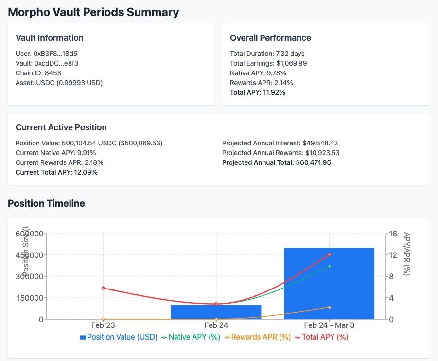
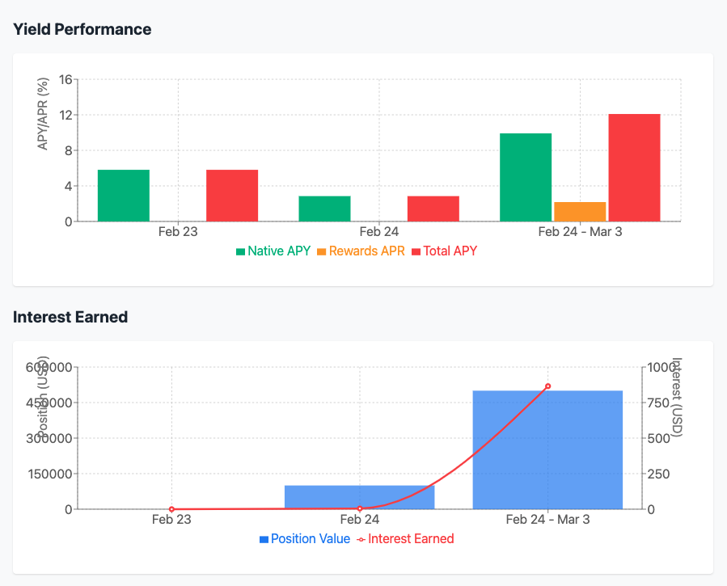
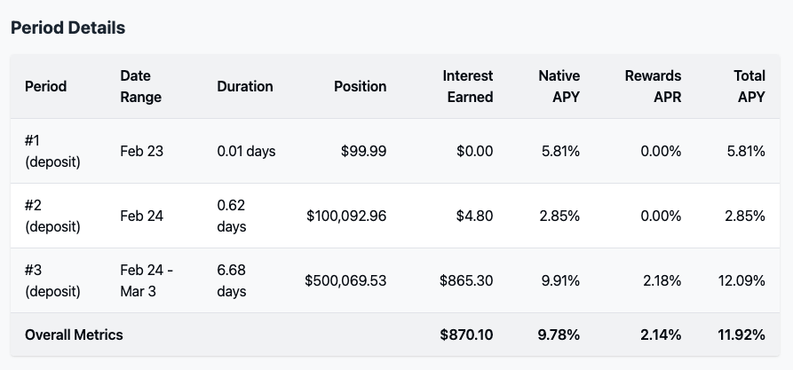

# Morpho Vault Periods Analyzer

A precision tool for tracking and analyzing user performance in Morpho Vaults. This analyzer breaks down interaction history into discrete periods, calculates yield from two distinct sources (native yield and rewards), and provides clear metrics in both underlying asset units and USD.

## Table of Contents

| Section                                               | Description                                                                            |
| ----------------------------------------------------- | -------------------------------------------------------------------------------------- |
| [Important Notes](#important-notes)                   | Disclaimers and usage guidelines                                                       |
| [Visualization](#visualization)                       | Charts and visual components available                                                 |
| [Key Concepts](#key-concepts)                         | Core yield calculation principles                                                      |
| [Overview](#overview)                                 | High-level system description                                                          |
| [Features](#features)                                 | Main capabilities of the analyzer                                                      |
| [What It Measures](#what-it-measures)                 | Detailed explanation of yield calculations                                             |
| [Position Metrics](#position-metrics)                 | How position values are calculated                                                     |
| [Overall Metrics](#overall-metrics)                   | Weighted average calculations across periods                                           |
| [Technical Implementation](#technical-implementation) | Data sources and calculation methodology                                               |
| [Output Data](#output-data)                           | Types of results provided by the analyzer                                              |
| [Requirements](#requirements)                         | System and environment requirements                                                    |
| [Dependencies](#dependencies)                         | Required libraries and packages                                                        |
| [Usage](#usage)                                       | Instructions for running the analyzer                                                  |
| [Example Output](#example-output)                     | Sample results from the analyzer (the visualization corresponds to the example output) |

## Important Notes

- Those scripts are for educational purposes only.
- It is not expected that the contributor(s) of this repository will be available to provide more support.
- The mathematical formulas expressed here can be changed and adapted to the needs of the user.
- The code is not optimized for performance and could be improved.
- As you will understand, the current rewards endpoint provides the entire rewards earned for a given user over a selected interval, on the entire Morpho Stack. If one has multiple vault positions, the data returned will be the sum of all rewards earned for the user over the selected interval. It is up to the user of the script to adapt the code to their needs and reflect the result they expect to get. E.g: if a user has 2 vault positions one in Vault1, and one in Vault2, the script will return the sum of all rewards earned for the user over the selected interval for both vaults.

## Visualization

The analyzer provides rich data that can be visualized to better understand vault performance over time. The visualization components help track key metrics like position size, APY/APR rates, and earned interest over time.

### Available Visualizations

The following charts are included in the visualization component:

- Position Timeline: A combined chart showing position value and yield rates over time
- Yield Performance: Bar chart comparing Native APY, Rewards APR and Total APY
- Interest Earned: Visualization of accrued interest and rewards
- Detailed Metrics Table: Tabular view of all position periods and metrics





### Using the Visualization Component

The visualization code is available in the `visualization` folder.

## Key Concepts

- **Native Yield (APY)**: Calculated using compound interest, reflecting how the vault's price-per-share appreciation compounds over time.
- **Rewards Yield (APR)**: Calculated using simple interest, as rewards do not compound.
- **Total Yield**: Combined effect of native yield and rewards yield, providing an overall performance metric.

## Overview

The Morpho Vault Periods Analyzer connects directly to blockchain data and a rewards API to build a timeline of a user's deposits and withdrawals. It processes each period between interactions to compute comprehensive yield metrics.

## Features

- **Blockchain Data Integration**: Fetches deposit and withdrawal events directly from vault smart contracts
- **Period-Based Analysis**: Analyzes performance between each user interaction
- **Dual Yield Tracking**: Separately calculates native yield and rewards yield
- **USD Conversion**: Provides all metrics in both underlying asset units and USD
- **Rewards API Integration**: Fetches and processes rewards data from external APIs
- **Active Position Projections**: Shows projected earnings for currently active positions

## What It Measures

### Native Yield (Compounding APY)

- **Period Return Rate**:
  `r = interestAccrued / startValue`

- **Annualization Factor (AF)**:
  `AF = (365 × 86400) / periodDurationInSeconds`

- **Compound Interest APY**:
  `nativeAPY = ((1 + r)^AF - 1) × 100`

  This formula annualizes the period return by compounding it over a year, resulting in an Annual Percentage Yield that accurately reflects reinvestment effects.

### Rewards Yield (Simple Rewards APR)

- **Rewards Return Rate**:
  `rRewards = totalRewardsAccruedUSD / startValue`

- **Simple Annualization**:
  `rewardsAPR = rRewards × AF × 100`

  Rewards are assumed not to compound; therefore, a simple interest model is used. This reflects the actual behavior of external rewards which are distributed separately from the vault's native yield.

### Combined Total Yield

`totalAPY = nativeAPY + rewardsAPR`

The combined yield represents the total performance of the position, accounting for both native compounding returns and external rewards.

## Position Metrics

- **Position Value**: Computed in underlying asset units (using price-per-share) and converted to USD using real-time asset price data.
  `positionValue = currentShares × pricePerShare`

- **Accrued Interest**: The difference in position value between the start and end of a period.
  `interestAccrued = endValue - startValue`

- **Rewards Accrued**: Fetched via an external API and processed per period.

## Overall Metrics

Weighted averages are computed over all periods (weighted by both the duration and the USD value of the position):

- **Weight per Period**:
  `weight = periodDurationInSeconds × positionAmountUSD`

- **Weighted Average Calculation**:
  `weightedMetric = Σ(metricValue × weight) / Σweight`

This provides:

- Overall Native APY
- Overall Rewards APR
- Overall Total APY
- Total interest, rewards, and earnings in USD

## Technical Implementation

### Data Sources

- **Blockchain Events**: Retrieves `Deposit` and `Withdraw` events along with block timestamps and vault metrics
- **Vault Contract Calls**: Reads underlying asset information and functions to get `totalAssets` and `totalSupply`
- **Rewards API**: Uses the endpoint `https://rewards.morpho.org/v1` to get rewards timeseries data
- **Asset Metadata API**: Fetches asset details such as `symbol`, `decimals`, and current price in USD

### Calculation Methodology

#### Price Per Share

For each relevant block, price-per-share is calculated as:

`pricePerShare` = `totalAssets` / `totalSupply`

where `totalAssets` and `totalSupply` are fetched from the vault contract.
This is used to determine the value of a user's shares in terms of the underlying asset.
More info in the [Morpho Vaults documentation](https://docs.morpho.org/morpho-vaults/tutorials/ERC4626-price).

#### Period-Based Calculations

For a period between two interactions:

**Calculate Position Value**:

- Start: `startValue = currentShares × startPricePerShare`
- End: `endValue = currentShares × endPricePerShare`

**Native Interest Accrued**:
`interestAccrued = endValue - startValue`

**Duration**:
Measured in seconds (from block timestamps).

**Rewards Accrued**:
Fetched from the rewards API and converted to USD using the asset's current price.

### Performance Optimization

- **Dynamic Interval Selection**: Automatically selects the appropriate interval (hourly or daily) based on period duration
- **Caching System**: Implements caching for rewards data to minimize API calls and improve performance
- **Parallel Processing**: Uses `Promise.all` for concurrent execution of blockchain queries

## Output Data

The analyzer provides three primary outputs:

### Enhanced Period Summary

Detailed information per period, including start/end blocks, timestamps, position values, accrued interest, rewards, and computed yield (both native APY and rewards APR).

### Overall Position Metrics

Aggregated metrics such as total interest earned, total rewards earned, overall native APY, rewards APR, and combined total APY over the entire position duration.

### Real-Time Active Position Summary

For the current active period (if any), the analyzer displays live metrics and projected annual earnings based on the current yield.

## Requirements

- Node.js: v16.x or higher
- Package Manager: yarn (preferred) or pnpm
- Environment Variables: Create a `.env` file with the following:
  ```
  RPC_URL_MAINNET=your_ethereum_node_url
  RPC_URL_BASE=your_base_node_url
  ```

## Dependencies

- `@morpho-org/blue-sdk`: ^2.3.1
- `viem`: ^2.23.3

## Usage

Install dependencies:

```
yarn
```

Execute the analyzer:

```
yarn start
```

## Example Output

The analyzer generates a comprehensive report including:

- User and vault information
- Current active position details
- Overall position metrics
- Detailed period-by-period analysis
- Projected earnings based on current rates

Note: the following example took a random user on a random Morpho Vault.

```json
yarn run v1.22.22
warning package.json: No license field
$ npx ts-node script/data.ts
Analyzing vault periods for user 0xB3F8A1885bb8C1afFe4980d8926132A0C3A318d5
Vault: 0xcdDCDd18A16ED441F6CB10c3909e5e7ec2B9e8f3 on chain 8453
Underlying asset: 0x833589fCD6eDb6E08f4c7C32D4f71b54bdA02913
Asset data fetched: USDC at 0.99993
Found 3 deposits and 0 withdrawals
Processed all interactions in 1.76 seconds

      Using hour interval for rewards for period 2025-02-23 to 2025-02-23 (0.01 days)
Fetching rewards data from: https://rewards.morpho.org/v1/users/0xB3F8A1885bb8C1afFe4980d8926132A0C3A318d5/balances/timeseries?from=2025-02-23&to=2025-02-23&interval=hour&chain_id=8453

      Using hour interval for rewards for period 2025-02-23 to 2025-02-24 (0.62 days)
Fetching rewards data from: https://rewards.morpho.org/v1/users/0xB3F8A1885bb8C1afFe4980d8926132A0C3A318d5/balances/timeseries?from=2025-02-23&to=2025-02-24&interval=hour&chain_id=8453

      Using day interval for rewards for period 2025-02-24 to 2025-03-03 (6.68 days)
Fetching rewards data from: https://rewards.morpho.org/v1/users/0xB3F8A1885bb8C1afFe4980d8926132A0C3A318d5/balances/timeseries?from=2025-02-24&to=2025-03-03&interval=day&chain_id=8453
Calculated 3 periods

=== ENHANCED VAULT PERIODS SUMMARY ===
User: 0xB3F8A1885bb8C1afFe4980d8926132A0C3A318d5
Vault: 0xcdDCDd18A16ED441F6CB10c3909e5e7ec2B9e8f3
Chain ID: 8453
Underlying Asset: USDC (0x833589fCD6eDb6E08f4c7C32D4f71b54bdA02913)
Current Price: 0.99993

=== OVERALL POSITION METRICS ===
Total Position Duration: 7.32 days
Total Interest Earned: $870.10
Total Rewards Earned: $199.89
Total Earnings: $1069.99
Overall Native APY: 9.78%
Overall Rewards APR: 2.14%
Overall Total APY: 11.92%

=== CURRENT ACTIVE POSITION ===
Current Position: 500104.536793 USDC ($500069.53)
Current Native APY: 9.91%
Current Rewards APR: 2.18%
Current Total APY: 12.09%
Projected annual interest earnings: $49548.42 if current rate continues
Projected annual rewards earnings: $10923.53 if current rate continues
Projected annual total earnings: $60471.95 if current rates continue

Total Periods: 3

--- Period Details ---

Period #1 (deposit)
{
  periodeNumber: 1,
  type: 'deposit',
  startBlock: 26782070n,
  endBlock: 26782628n,
  startTimestamp: 1740353487n,
  endTimestamp: 1740354603n,
  positionShares: 99967616399835283122n,
  positionAmountUnderlyingUnits: 99999905n,
  positionAmountUSD: 99.99290500664999,
  positionAccruedInterestUnderlyingUnits: 200n,
  positionAccruedInterestUSD: 0.000199986,
  rewardsAccrued: [],
  totalRewardsAccruedUSD: 0,
  durationInSeconds: 1116,
  nativeAPY: 5.8143678508807195,
  rewardsAPR: 0,
  totalAPY: 5.8143678508807195
}
Duration: 0.01 days (2025-02-23T23:31:27.000Z to 2025-02-23T23:50:03.000Z)
Position: 99.999905 USDC (99.99)
Interest Earned: 0.0002 USDC (0.00)
Native APY: 5.81%
Rewards APR: 0.00%
Total APY: 5.81%

Period #2 (deposit)
{
  periodeNumber: 2,
  type: 'deposit',
  startBlock: 26782628n,
  endBlock: 26809594n,
  startTimestamp: 1740354603n,
  endTimestamp: 1740408535n,
  positionShares: 100067444869581274404221n,
  positionAmountUnderlyingUnits: 100099966789n,
  positionAmountUSD: 100092.95979132477,
  positionAccruedInterestUnderlyingUnits: 4803237n,
  positionAccruedInterestUSD: 4.80290077341,
  rewardsAccrued: [],
  totalRewardsAccruedUSD: 0,
  durationInSeconds: 53932,
  nativeAPY: 2.845487021018922,
  rewardsAPR: 0,
  totalAPY: 2.845487021018922
}
Duration: 0.62 days (2025-02-23T23:50:03.000Z to 2025-02-24T14:48:55.000Z)
Position: 100099.966789 USDC (100092.96)
Interest Earned: 4.803237 USDC (4.80)
Native APY: 2.85%
Rewards APR: 0.00%
Total APY: 2.85%

Period #3 (deposit)
{
  periodeNumber: 3,
  type: 'deposit',
  startBlock: 26809594n,
  endBlock: 27098139n,
  startTimestamp: 1740408535n,
  endTimestamp: 1740985625n,
  positionShares: 499918067354764804062908n,
  positionAmountUnderlyingUnits: 500104536793n,
  positionAmountUSD: 500069.5294754245,
  positionAccruedInterestUnderlyingUnits: 865358175n,
  positionAccruedInterestUSD: 865.29759992775,
  rewardsAccrued: [
    {
      assetAddress: '0xBAa5CC21fd487B8Fcc2F632f3F4E8D37262a0842',
      chainId: 8453,
      symbol: 'MORPHO',
      decimals: 18,
      rawAmount: 96389383089920557648n,
      formattedAmount: '96.389383089920557648',
      priceUsd: 2.073818170588733
    }
  ],
  totalRewardsAccruedUSD: 199.8940541037156,
  durationInSeconds: 577090,
  nativeAPY: 9.908307078772038,
  rewardsAPR: 2.1844018798088483,
  totalAPY: 12.092708958580886
}
Duration: 6.68 days (2025-02-24T14:48:55.000Z to 2025-03-03T07:07:05.000Z)
Position: 500104.536793 USDC (500069.53)
Interest Earned: 865.358175 USDC (865.30)
Native APY: 9.91%
Rewards APR: 2.18%
Total APY: 12.09%
Rewards:
  96.389383089920557648 MORPHO (199.89)

=== END OF ENHANCED SUMMARY ===

Analysis complete. Found 3 periods.
Overall Native APY: 9.78%
Overall Rewards APR: 2.14%
Overall Total APY: 11.92%
✨  Done in 20.10s.
```
